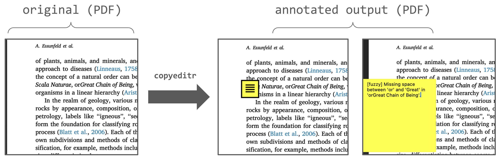

# copyeditr

Copyeditr is an AI tool (status: alpha) built to help catch typos and formatting errors in PDFs. It takes a PDF as input and generates an annotated PDF as output. It was developed in collaboration with OpenAI's `GPT-5.1`.

# Setup

`poetry.lock` and `pyproject.toml` and provided for easy installation using `poetry`. 
- After cloning the repository, run `poetry install`  

You will need an OpenAI API key, which you will need to paste into `template.env` replacing the text `YOUR_API_KEY_GOES_HERE`. Then **rename the file from `template.env` to simply `.env` so that `load_dotenv()` can find it.**

# Usage

`poetry run python annotate.py --no-refine path/to/your/file.pdf`  

- This will generate a new file called `annotated_output.pdf` with PDF comments at (or near) any identified typos.

# Wish-list

- Add support for Acrobat-openable PDFs (currently only tested with Preview)
- Test on Windows (currently only tested on Apple Silicon)
- Add flexibility re: model provider (Google, Anthropic, local, etc)
- Develop a test-set including typo-ridden and typo-free PDFs for evaluation

# Contributing

Please feel free to test this code, try things out, and run with it. If you think of ways to make it better or find bugs, feel free to reach out (ariessunfeld [at] gmail [dot] com) or open an Issue on this repository.

